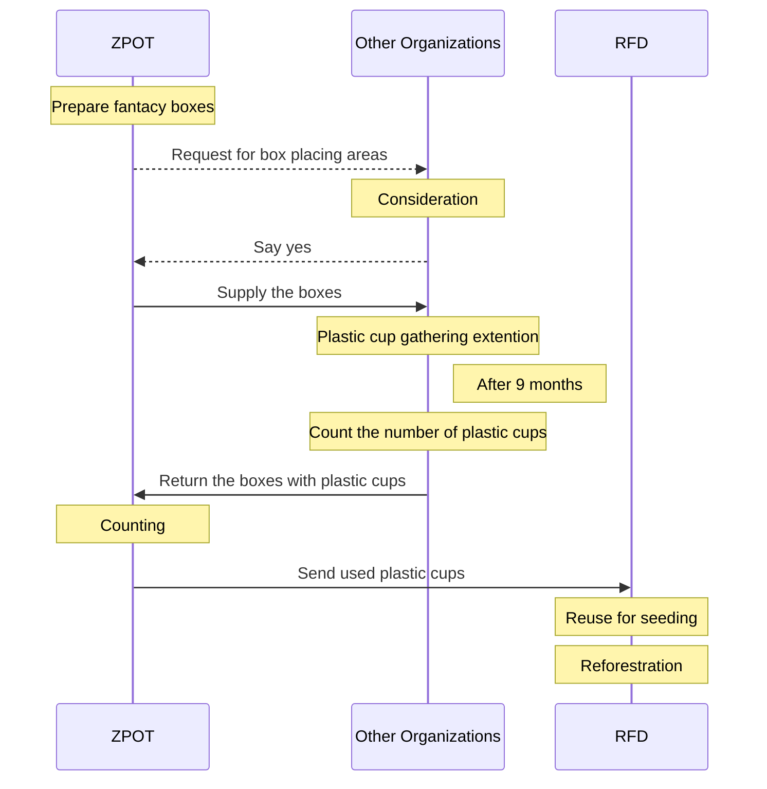
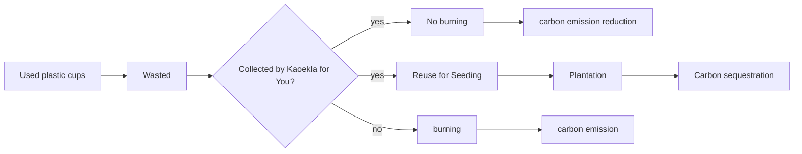

# Potential Carbon Reduction
_due to the ZPOT Kaeokla for You Project_

## Background
Based on Thailand’s population, the country was estimated to emit around 2,887.04 tonCO<sub>2</sub>eq/day or 1.05 million tons/year due to plastic waste. These emissions contribute to global GHG emissions, highlighting the need to __control plastic consumption and improve waste management practices__.[^1] 

In 2023, Zoological Park Organization of Thailand (ZPOT) conducted a project called "_Kaeokla for You_", to reduce carbon emission and to increase carbon sequestration by collecting used plastic cups and giving them to the Royal Forest Department (RFD) for reuse in seed cultivation in reforestration projects. Below is the project activities:


## Carbon Reduction Evaluator
Potential carbon reduction contribution from this project was evaluated using Carbon Reduction Evaluator (CER), a web app for evaluating the potential atmospheric carbon reduction and the potential carbon emission reduction due to the reuse of plastic cups for seed cultivation and reforestration. The app has been deployed at https://esc.mnre.go.th/app/co2/, which is based on the concepts described below.

The outcomes of the Kaeokla for You Project can be displayed as follows:


Considering both carbon emission reduction and carbon sequestration, we have:

## Carbon Emission Reduction (CER)
> _CER = c * w * e_    

where,
- _CER_ is carbon emision reduction due to plastic cup burning (tonCO<sub>2</sub>eq)
- _c_ is the number of burned plastic cups (cups)
- _w_ is the weight of one plastic cup (0.015 kg) 
- _e_ is the average emission factor from plastic cup burning (3.54 kgCO<sub>2</sub>eq/kg).

## Potential Carbon Reduction (CR)
> _CR = n * m * t * 1/d * s_

where,
- _CR_ is the potential carbon reduction due to sequestration (tonCO<sub>2</sub>eq/year)
- _n_ is the number plastic cups collected (cups/month)
- _m_ is the number of months per year (12 months/year)
- _t_ is the number of plant seed per cup (seed/cup) 
- _d_ is the plantation density (200 trees/Rai)
- _s_ is carbon reduction rate due to sequestration (tonCO<sub>2</sub>eq/Rai/year), which depends on tree species and the suitability of the plantation sites[^2], expressed in JavaScript as follows:
  
```
var cr = "";
if(tree=="sak" && area=="much"){cr=2.16;}
else if(tree=="yuka" && area=="much"){cr=6.09;}
else if(tree=="thepha" && area=="much"){cr=6.09;}
else if(tree=="narong" && area=="much"){cr=4.4;}
else if(tree=="yak" && area=="much"){cr=6.49;}

else if(tree=="sak" && area=="moderate"){cr=1.72;}
else if(tree=="yuka" && area=="moderate"){cr=4.77;}
else if(tree=="thepha" && area=="moderate"){cr=4.4;}
else if(tree=="narong" && area=="moderate"){cr=3.48;}
else if(tree=="yak" && area=="moderate"){cr=4.8;}

else if(tree=="sak" && area=="less"){cr=1.36;}
else if(tree=="yuka" && area=="less"){cr=3.15;}
else if(tree=="thepha" && area=="less"){cr=4.00;}
else if(tree=="narong" && area=="less"){cr=2.27;}
else if(tree=="yak" && area=="less"){cr=0.77;}

else{cr=0;}
```

## Hypotheses
1. Plastic cups are 12 g each.
2. 7.8% of all the plastic cups are subject to open burning.
3. Emission factor (open burning) of plastic products is 3.54 kgCo2eq/kg (Kittithammavong et al., 2023)
4. Carbon sequestration is taken from TGO (2559)


[^1]: Kittithammavong, V., Khanitchaidecha, W., and P. Thongsanit. 2023. CO2 Emissions from Plastic Consumption Behaviors in Thailand. [Sustainability 15(16):12135](https://www.mdpi.com/2071-1050/15/16/12135)
[^2]: TGO. 2559. <i>How Can Plantation Reduce Global Warming</i> (in Thai), ([PDF](https://esc.mnre.go.th/app/co2/Tree_version02.pdf)).
