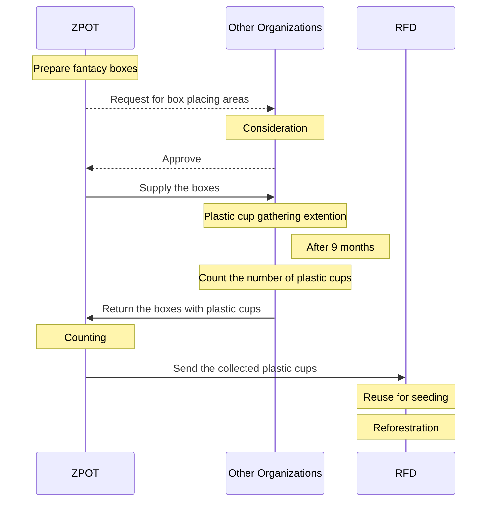
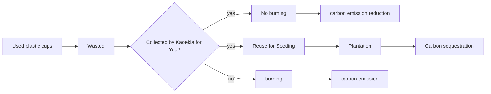

# Potential Carbon Reduction
_from Plastic Cup Reuse for Seed Cultivation and Reforestration due to the ZPOT Kaeokla for You Project_


## Background
Thailand was estimated to emit around 2,887.04 tonCO<sub>2</sub>eq/day or 1.05 million tons/year due to plastic waste. These emissions contribute to global GHG emissions, highlighting the need to control plastic consumption and improve waste management practices.[^1] 

Therefore, the Zoological Park Organization of Thailand (ZPOT) conducted a carbon project called ["_Kaeokla for You_"](https://www.thairath.co.th/futureperfect/articles/2724870), to reduce carbon emission and increase carbon sequestration, by supplying zoo-animal-like boxes to participating agencies for collecting used plastic cups. The collected cups were all sent to the Royal Forest Department (RFD) for reuse in seed cultivation in governmental reforestration projects. Below is the project activities:


## Carbon Reduction Evaluator
Potential carbon reduction contributed by the Kaeokla for You project was evaluated using Carbon Reduction Evaluator (CRE), a web app for evaluating the potential atmospheric carbon reduction and the potential carbon emission reduction due to the reuse of plastic cups for seed cultivation and reforestration. The app was deployed at https://esc.mnre.go.th/app/co2/, of which the major underlying concepts or assumptions are given below.

The carbon outcomes of the Kaeokla for You project were characterized as follows:


Hence, we have two sides of carbon management: carbon emission reduction and carbon absorption via sequestration extension.   

### Carbon Emission (CE)
> _CE = c * w/f * EF_    

where,
- _CE_ is carbon emission from plastic cup burning (tonCO<sub>2</sub>eq)
- _c_ is the number of burned plastic cups (cups)
- _w_ is the average weight of plastic cups (0.012 kg)
- _f_ is a factor to convert kg to ton (1000 kg/ton)
- _EF_ is the average emission factor from plastic product burning (3.54 kgCO<sub>2</sub>eq/kg).[^1]

### Potential Carbon Reduction (PCR)
> _PCR = n * m * t * 1/d * cr_

where,
- _PCR_ is the potential carbon reduction due to sequestration (tonCO<sub>2</sub>eq/year)
- _n_ is the number plastic cups collected (cups/month)
- _m_ is the number of months per year (12 months/year)
- _t_ is the number of seeds per cup (seeds/cup) 
- _d_ is the plantation density (200 trees/Rai)
- _cr_ is carbon reduction rate due to sequestration (tonCO<sub>2</sub>eq/Rai/year), determined by tree species and plantation area suitability[^2], expressed in JavaScript as follows:
  
```
var cr = "";
if(tree=="sak" && area=="much"){cr=2.16;}
else if(tree=="yuka" && area=="much"){cr=6.09;}
else if(tree=="thepha" && area=="much"){cr=6.09;}
else if(tree=="narong" && area=="much"){cr=4.4;}
else if(tree=="yak" && area=="much"){cr=6.49;}

else if(tree=="sak" && area=="moderate"){cr=1.72;}
else if(tree=="yuka" && area=="moderate"){cr=4.77;}
else if(tree=="thepha" && area=="moderate"){cr=4.4;}
else if(tree=="narong" && area=="moderate"){cr=3.48;}
else if(tree=="yak" && area=="moderate"){cr=4.8;}

else if(tree=="sak" && area=="less"){cr=1.36;}
else if(tree=="yuka" && area=="less"){cr=3.15;}
else if(tree=="thepha" && area=="less"){cr=4.00;}
else if(tree=="narong" && area=="less"){cr=2.27;}
else if(tree=="yak" && area=="less"){cr=0.77;}

else{cr=0;}
```
where, sak refers to teak (_Tectona grandis_), yuka Eucalyptus (_Eucalyptus melliodora_), thepha _Acacia mangium_, narong _Acacia auriculiformis_, yak _Leucaena leucocephala_, area the plantation area suitability, cr the carbon reduction rate due to sequestration (tonCO<sub>2</sub>eq/Rai/year).   

### Assumptions
1. Plastic cups are 12 g each.
2. 7.8% of all the plastic cups are subject to open burning.
3. Emission factor (open burning) of plastic products is 3.54 kgCo2eq/kg.[^1]
4. Carbon sequestration depends on both tree species and plantation area suitability.[^2]


__References__
[^1]: Kittithammavong, V., Khanitchaidecha, W., and P. Thongsanit. 2023. CO2 Emissions from Plastic Consumption Behaviors in Thailand. [Sustainability 15(16):12135](https://www.mdpi.com/2071-1050/15/16/12135)
[^2]: TGO. 2559. <i>How Can Plantation Reduce Global Warming</i> (in Thai), ([PDF](https://esc.mnre.go.th/app/co2/Tree_version02.pdf)).
