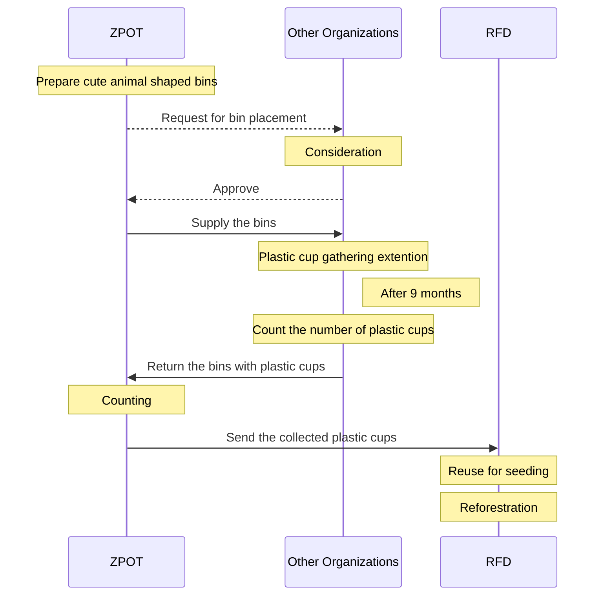
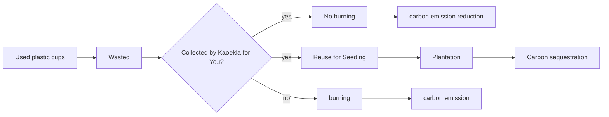

# Potential Carbon Reduction
_Reducing Plastic Waste and Carbon Emissions: The ZPOT Kaeokla for You Project_


## Background
Thailand's plastic waste is estimated to contribute approximately 1.05 million tons of greenhouse gas emissions annually, equivalent to 2,887.04 tonCO<sub>2</sub>eq/day. This significant amount contributes to global climate change, emphasizing the urgent need to reduce plastic consumption and improve waste management practices[^1].

The Zoological Park Organization of Thailand (ZPOT) conducted a carbon project called ["_Kaeokla for You_"](https://www.thairath.co.th/futureperfect/articles/2724870), to reduce carbon emission and increase carbon sequestration, by supplying zoo-animal shaped bins to participating agencies for collecting used plastic cups. The cups were then sent to the Royal Forest Department (RFD) for starting seeds in reforestation projects. Below is the project activities:


## Carbon Reduction Evaluator
The ZPOT Kaeokla for You project's potential carbon reduction was assessed using the Carbon Reduction Evaluator (CRE). This web application [https://esc.mnre.go.th/app/co2/](https://esc.mnre.go.th/app/co2/) estimates the CO<sub>2</sub> reduction achieved by reusing plastic cups for seed cultivation and reforestation projects. Here are the key assumptions used by the CRE:

The carbon outcomes of the Kaeokla for You project are as follows:


The Kaeokla for You project addresses both sides of carbon management: reducing carbon emissions and increasing carbon absorption through sequestration. This dual approach is crucial for effectively mitigating climate change.

### Carbon Emission (CE)
> _CE = c * w * EF/f_    

where,
- CE is the carbon emission from plastic cup burning (tonCO<sub>2</sub>eq)
- c is the number of burned plastic cups (cups)
- w is the average weight of plastic cups (0.012 kg)
- EF is the average emission factor from plastic product burning (3.54 kgCO2eq/kg)
- f is a factor to convert kg to ton (1000 kg/ton)

### Potential Carbon Reduction (PCR)
> _PCR = n * m * t * s * 1/d * cr_

where,
- _PCR_ is the potential carbon reduction due to sequestration (tonCO<sub>2</sub>eq/year)
- _n_ is the number plastic cups collected (cups/month)
- _m_ is the number of months per year (12 months/year)
- _t_ is the number of seeds per cup (seeds/cup) 
- _s_ is the survival rate (tree/seed)
- _d_ is the plantation density (200 trees/Rai)
- _cr_ is carbon reduction rate due to sequestration (tonCO<sub>2</sub>eq/Rai/year), determined by tree species and plantation area suitability[^2], expressed in JavaScript as follows:
  
```
var cr = "";
if(tree=="sak" && area=="much"){cr=2.16;}
else if(tree=="yuka" && area=="much"){cr=6.09;}
else if(tree=="thepha" && area=="much"){cr=6.09;}
else if(tree=="narong" && area=="much"){cr=4.4;}
else if(tree=="yak" && area=="much"){cr=6.49;}

else if(tree=="sak" && area=="moderate"){cr=1.72;}
else if(tree=="yuka" && area=="moderate"){cr=4.77;}
else if(tree=="thepha" && area=="moderate"){cr=4.4;}
else if(tree=="narong" && area=="moderate"){cr=3.48;}
else if(tree=="yak" && area=="moderate"){cr=4.8;}

else if(tree=="sak" && area=="less"){cr=1.36;}
else if(tree=="yuka" && area=="less"){cr=3.15;}
else if(tree=="thepha" && area=="less"){cr=4.0if(tree=="narong" && area=="less"){cr=2.27;tree=="yak" && area=="less"){cr=0.77;}

else{cr=0;}
```
where, sak refers _Tectona grandis_, yuka _Eucalyptus melliodora_, thepha _Acacia mangium_, narong _Acacia auriculiformis_, yak _Leucaena leucocephala_, area the plantation area suitability, and cr the carbon reduction rate due to sequestration (tonCO<sub>2</sub>eq/Rai/year).   

### Assumptions
1. Each plastic cup weighs 12 grams.
2. 7.8% of all plastic cups are subjected to open burning.
3. The emission factor for open burning of plastic products is 3.54 kgCO2eq/kg.[^1]
4. Carbon sequestration rates vary depending on tree species and plantation area suitability.[^2]

Climate change is due to global warming, which causes Antractic Ice Sheet melting,  which raises sea level. For more analysis, see this [paper](https://kietpawpan.github.io/carbon/paper.html).

__References__
[^1]: Kittithammavong, V., Khanitchaidecha, W., and P. Thongsanit. 2023. CO2 Emissions from Plastic Consumption Behaviors in Thailand. [Sustainability 15(16):12135](https://www.mdpi.com/2071-1050/15/16/12135)
[^2]: TGO. 2559. <i>How Can Plantation Reduce Global Warming?</i> (in Thai), ([PDF](https://esc.mnre.go.th/app/co2/Tree_version02.pdf)).

